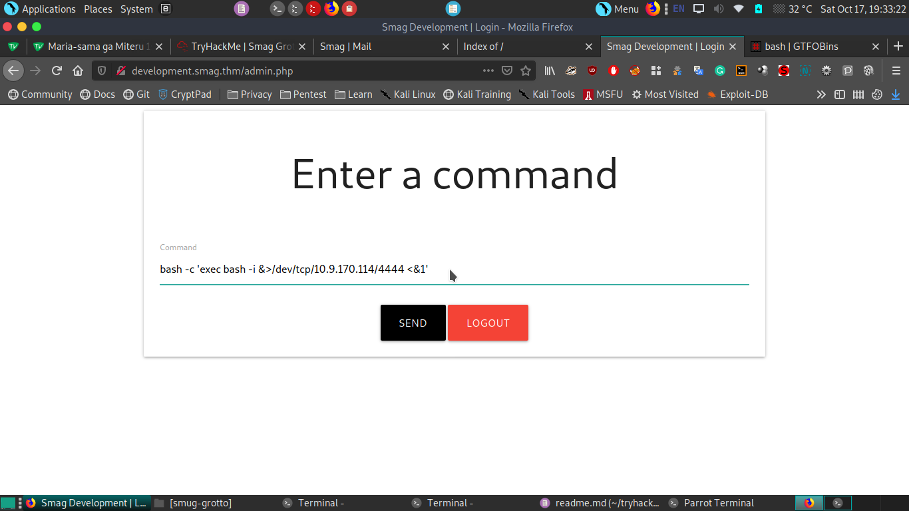
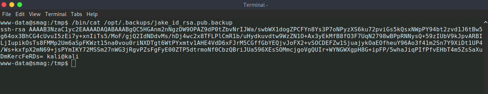

# initial

## nmap 
```
┌─[mayomacam@parrot]─[~/tryhackme/smug-grotto]
└──╼ $sudo nmap --min-rate 1000 -p- 10.10.74.157
[sudo] password for mayomacam: 
Starting Nmap 7.80 ( https://nmap.org ) at 2020-10-17 18:05 IST
Nmap scan report for 10.10.74.157
Host is up (0.20s latency).
Not shown: 65533 closed ports
PORT   STATE SERVICE
22/tcp open  ssh
80/tcp open  http

Nmap done: 1 IP address (1 host up) scanned in 72.36 seconds

```

## dirsearch

```
[18:06:42] 200 -  402B  - /index.php
[18:06:42] 200 -  402B  - /index.php/login/
[18:06:51] 301 -  311B  - /mail  ->  http://10.10.74.157/mail/
[18:06:51] 200 -    2KB - /mail/
```
## port80


### mail


in page source i got a bcc.


in mail "Note: all attachments must be downloaded with wget." this tell many thing. As name suggest we have to analyze pcap file which we can see dHJhY2Uy.pcap.

so i use wget to download pcap file.


Let's analyze pcap file.


got creds..

username= he******
password= cH**********


## /login
there is a login let's login now using creds.


but there is no login page. let's again check mail and pcap.

### development.smag.thm
and got second domain development.smag.thm .
let's add it to hosts file for access using domain name.


got index.
now let's see login.php


when we click on admin we redirect to login.php
now let's login.

after login got admin.php.


let's see what commands we can run.

### admin.php

we can run commands but can't see output. so i try to upload reverse shell.


shell was uploaded but can't find it.
now left is to run reverse shell command directly.


got shell.


# user

## linenum

using linenum i got crontab where id_rsa file being copied into jake .ssh folder.


## id-rsa
got jake id_rsa.pub file.


we have permission to write that file.


let's set it to our key.
after changeing key to our key. we got ssh into jake.


and user.txt.

# root

## history


## root flag
let's try to get root shell. 
we check for sudo permission we have as jake.


from gftobins we tried all three of them last one work and we got our shell.


# bonus

## root flag 

in history i see some file edits so i check .viminfo file for history of vim. and got user and root both flag in one place.


